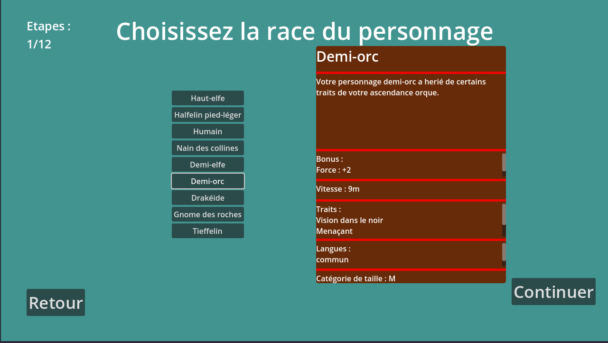
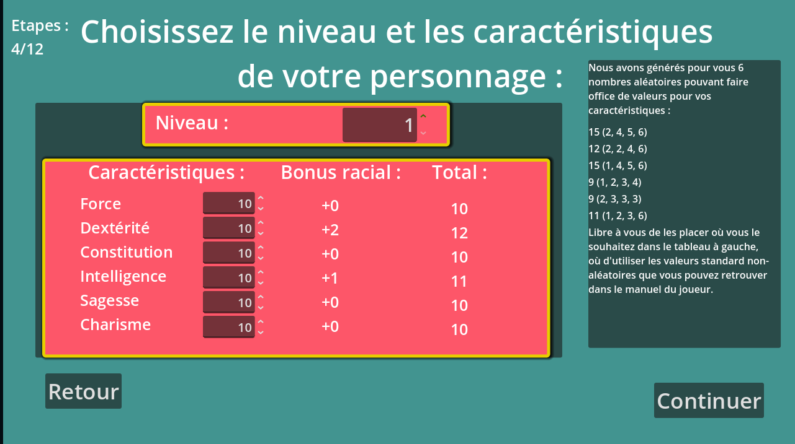
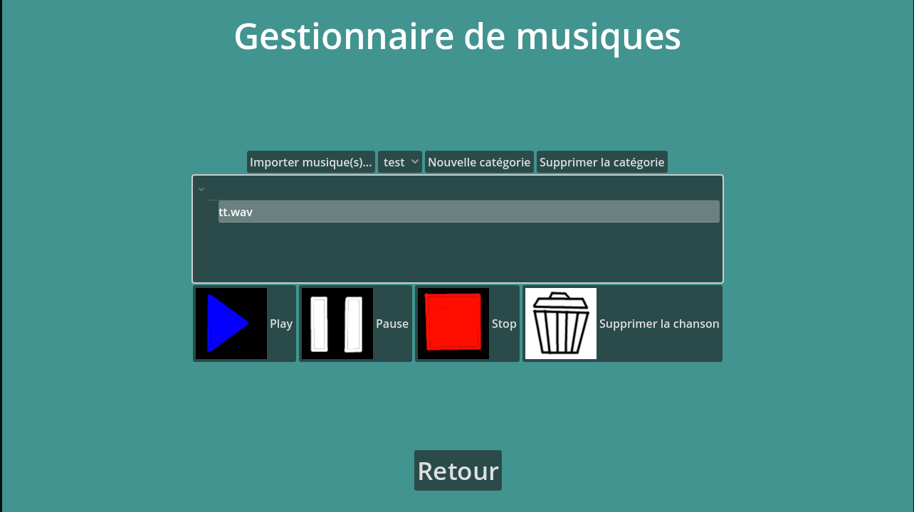

<h1>L'assistant du MD</h1>

<h1>Sommaire</h1>
Voici un sommaire récapitulant les points clés de ce README :
 
- <a href="#description">Description du logiciel</a>
 
- <a href="#installation">Installation du logiciel.</a>
 
- <a href="#fonctions">Fonctionnalités du logiciel</a>
 
- <a href="#exemples">Exemples d'utilisation du logiciel</a>
 
- <a href="#credits">Remerciements</a>
 

<h1>1. Description</h1>
Ce logiciel a été conçu pour permettre aux maîtres du donjon de gérer la tâche difficile qu'est la gestion d'une partie de Donjons &amp; Dragons 🐲.
 
En tant que MD, je sais que nous avons tous besoin d'un outil "surpuissant" qui nous permettrait à nous les MD, de tout contrôler à un endroit.
 
Malheureusement, le peu de logiciels offrant ce genre de fonctionnalités possèdent souvent tous une partie sombre et payante.
 
Avec L'assistant du MD, fini ces ennuis ! Vous possédez désormais un logiciel libre et gratuit qui vous prodiguera (je l'espère), un confort supplémentaire lors de vos sessions.
 
 
(Note : Le logiciel n'étant encore qu'au début de son développement, il est normal qu'il ne soit pas tout à fait au point, et même qu'il ne permette pas d'aider à faire la moindre partie).

<h1>2. Installation</h1>
Pour utiliser le logiciel vous avez deux options.
La première (qui sera accessible uniquement lorsque le développement sera assez poussé) consistera à télécharger un logiciel exécutable directement dans la section Releases de github.
 

 
La seconde, consiste à cloner le repository avec cette commande sur votre ordinateur : 
 
 
<code>git clone https://github.com/Geekdu25/ASSIST_MD</code>
 
 
Ensuite, vous n'avez qu'à ouvrir le fichier project.godot avec le moteur de jeu Godot Game Engine, et à le lancer pour voir le résultat, et potentiellement le modifier comme vous le souhaitez !

<h1>3. Fonctionnalités</h1>
Actuellement, le logiciel en étant encore à un stade de développement très bas, les fonctionnalités du logiciel sont limitées.
 
Néanmoins, j'ai déjà réussi à implémenter les fonctionnalités suivantes : 
 
 
 - Un système très primaire de gestion des sauvegardes qui permet de créer automatiquement, dès le premier démarrage, les données de sauvegarde nécessaires au bon fonctionnement de l'application.
 De plus ce système permet de supprimer ces données de sauvegarde efficacement avec un bouton sur l'écran de démarrage de l'application.
 
 
 - Le logiciel comporte également un système de gestion de pages permettant à l'application de se comporter comme un navigateur web vous faisant voyager à travers plusieurs pages.
 
 
 - La possibilité de choisir sa race et sa classe et de voir leurs informations. Il est également possible de charger ses propres races et classes personnalisés !

<h1>4. Exemples</h1>
Découvrez ici quelques captures d'écran du logiciel en action : 
 
 

 
 

 
 

<h1>5. Remerciements</h1>

Ce logiciel a été codé avec le moteur de jeu Godot Game Engine : <a href="https://godotengine.org/">https://godotengine.org</a>.
 
Il s'agit d'un moteur de jeu entièrement libre de droit et gratuit sous licence MIT.
 
 
Un grand merci à lui sans qui ce logiciel n'aurait pas pu exister. (Je ne suis pas affilié à Godot Game Engine pour autant)
 
 
(Note : Le logo de Godot Game Engine est sous licence : Creative Commons By 4.0. <a href="https://creativecommons.org/licenses/by/4.0">https://creativecommons.org/licenses/by/4.0</a>
Il est accessible à l'adresse : <a href="https://godotengine.org/press/">https://godotengine.org/press</a>)
